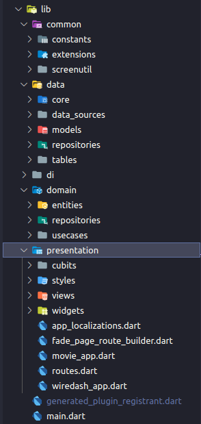
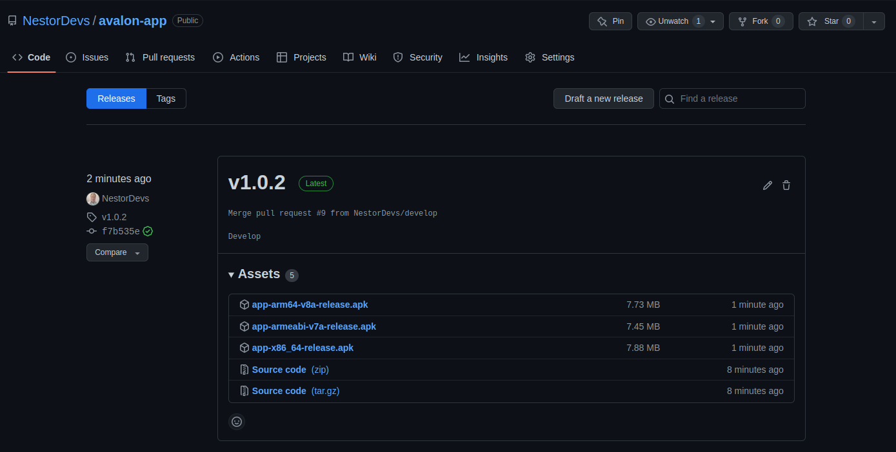

# Avalon Movie App Test

Una App de peliculas para test Avalon.

## Algunos paquetes usados en el desarrollo de Avalon App

```
dartz: Un paquete para un mejor mmanejo de errores
flutter_bloc: gestionar la administracion de estado y logic de la app
get_it: localizador de servicios y mejora la inyeccion de dependencias
google_fonts: estilisa la fuente de la app
hive: base de datos local para el respaldo de los datos en el dispositivo
http: para realizar solicitudes a la api rest de Movie db
```

## Arquitectura Usada

- Clean code basado en capas:
  - Data layer
  - domain layer
  - presentation layer

## Estructura de carpetas

</img>

## Continuos Integration and Continuos Delivery

- Basado en github Actions
- Solo Android
- Flujo de Construccion de entregable APK
- Localizacion en release de Github Code

Fuente:
https://github.com/NestorDevs/avalon-app/releases

Captura

</img>
